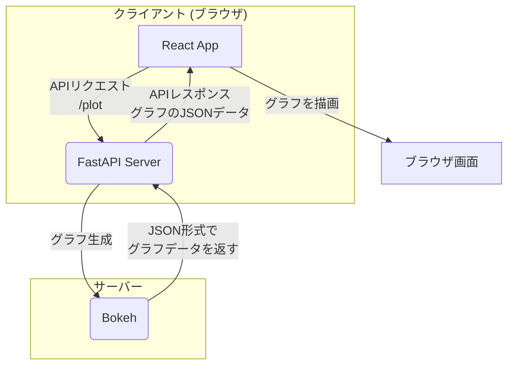

## はじめに

Pythonはデータ分析や可視化に非常に強力な言語ですが、その結果をモダンなWebアプリケーションで表示したいと考えたことはありませんか？
この記事では、Pythonのグラフ描画ライブラリ**Bokeh**と、人気のフロントエンドライブラリ**React**を連携させる方法を解説します。

### この記事が解決する課題

- Pythonで作成したグラフを、インタラクティブなWebページに埋込みたい。
- バックエンド(Python)とフロントエンド(React)を分離した構成で、Webアプリケーションを構築したい。
- Bokeh Serverを使わずに、より柔軟なフロントエンド技術でグラフをレイアウトしたい。

### ターゲット読者

- Pythonでのデータ処理に慣れており、Web上での可視化に挑戦したい方
- Reactでのフロントエンド開発経験があり、Pythonバックエンドとの連携方法を探している方

### 記事のゴール

この記事を読み終える頃には、以下のことができるようになります。
- FastAPIを使って、Bokehで生成したグラフをJSON形式で配信するAPIを構築する。
- ViteでセットアップしたReact環境からAPIを呼び出し、グラフを動的に描画する。

## システム構成

今回構築するシステムの全体像は以下の通りです。クライアント（ブラウザ）からのリクエストに応じて、FastAPIサーバーがBokehグラフを生成し、Reactアプリケーションがそれを取得して表示します。



このようにバックエンドとフロントエンドを分離することで、それぞれ得意な技術に集中でき、スケーラブルな開発が可能になります。

## バックエンド編: FastAPIとBokehでAPIを構築する

まずは、グラフを生成して配信するAPIをPythonで作成します。ここでは、高速でモダンなWebフレームワークである**FastAPI**を利用します。

### 1. 環境構築

以下のライブラリをインストールします。

```bash
pip install fastapi "uvicorn[standard]" bokeh
```

`requirements.txt`として保存しておくと、他の環境でも再現しやすくなります。

```txt:requirements.txt
fastapi
uvicorn[standard]
bokeh
```

### 2. APIサーバーの実装

リクエストを受けたらBokehでグラフを生成し、`bokeh.embed.json_item`を使ってJSON形式に変換して返すAPIを作成します。

`main.py`というファイル名で保存してください。

```python:main.py
import json
from fastapi import FastAPI
from starlette.middleware.cors import CORSMiddleware
import bokeh
from bokeh.plotting import figure

# FastAPIアプリケーションの初期化
app = FastAPI()

# CORS (Cross-Origin Resource Sharing) の設定
# フロントエンド(React)が別オリジン(ポート3000)で動作するため、
# ブラウザからのAPIアクセスを許可する設定
app.add_middleware(
    CORSMiddleware,
    allow_origins=["*"],  # 本番環境では '*' ではなく、特定のオリジンを指定してください
    allow_credentials=True,
    allow_methods=["*"],
    allow_headers=["*"],
)

@app.get("/plot")
def get_plot():
    # サンプルデータの準備
    x = [1, 2, 3, 4, 5]
    y = [6, 7, 2, 4, 5]

    # Bokehでグラフを作成
    p = figure(width=500, height=300, title="サンプルグラフ")
    p.line(x, y, legend_label="トレンド", line_width=2)

    # グラフをJSON形式に変換して返す
    return json.dumps(bokeh.embed.json_item(p, "myPlot"))
```

### 3. サーバーの起動

以下のコマンドでAPIサーバーを起動します。`--reload`オプションにより、コードを変更するとサーバーが自動で再起動します。

```bash
uvicorn main:app --reload --host 0.0.0.0 --port 8000
```

これで `http://localhost:8000/plot` にアクセスすると、グラフのJSONデータが表示されるはずです。

## フロントエンド編: ReactとViteでグラフを描画する

次に、APIから取得したデータを描画するフロントエンドを構築します。ここでは、高速なビルドツールである**Vite**を使ってReact環境をセットアップします。

### 1. 環境構築

以下のコマンドでReactプロジェクトを作成し、必要なライブラリをインストールします。

```bash
# Viteを使ってReactプロジェクトを作成
yarn create vite my-react-app --template react

# プロジェクトディレクトリに移動
cd my-react-app

# 依存ライブラリをインストール
yarn

# BokehJSライブラリをインストール
yarn add @bokeh/bokehjs
```

`package.json`には、以下のような依存関係が記録されます。

```json:package.json
{
  // ...
  "dependencies": {
    "@bokeh/bokehjs": "^3.0.0", // バージョンは適宜読み替えてください
    "react": "^18.2.0",
    "react-dom": "^18.2.0"
  },
  // ...
}
```

### 2. Reactコンポーネントの実装

`src/App.jsx` を書き換えて、APIを呼び出し、取得したデータをBokehJSで描画するコンポーネントを作成します。

```jsx:src/App.jsx
import React from 'react';
import * as Bokeh from '@bokeh/bokehjs';
import './App.css'; // 必要に応じてスタイルを調整

export default function App() {
  const handleFetchPlot = () => {
    // FastAPIサーバーのエンドポイントにリクエストを送信
    fetch('http://localhost:8000/plot')
      .then(res => res.json())
      .then(item => {
        // 帰ってきたJSONデータをパース
        const plotData = JSON.parse(item);
        // 'plot-container'というIDを持つdiv要素にグラフを描画
        Bokeh.embed.embed_item(plotData, 'plot-container');
      })
      .catch(error => console.error('Error fetching plot:', error));
  };

  return (
    <div className="App">
      <header className="App-header">
        <h1>Bokeh + React連携デモ</h1>
        <button onClick={handleFetchPlot}>グラフを取得</button>
        {/* グラフが描画されるコンテナ */}
        <div id="plot-container" className="bk-root"></div>
      </header>
    </div>
  );
}
```

### 3. jQueryの読み込み（注意点）

現在のバージョンの`@bokeh/bokehjs`は、内部でjQueryに依存している場合があります。もし`$ is not defined`のようなエラーがブラウザのコンソールに表示された場合は、`index.html`の`<head>`タグ内に以下の行を追加して、CDNからjQueryを読み込んでください。

```html:index.html
<head>
  <!-- ...他のタグ... -->
  <script src="https://code.jquery.com/jquery-3.6.0.min.js"></script>
  <title>Vite + React</title>
</head>
```

### 4. 開発サーバーの起動

以下のコマンドで、Reactの開発サーバーを起動します。

```bash
yarn dev --host 0.0.0.0 --port 3000
```

## 動作確認

ブラウザで `http://localhost:3000` を開きます。「グラフを取得」ボタンをクリックすると、FastAPIサーバーから取得したBokehグラフが描画されるはずです。


## まとめ

この記事では、Python(Bokeh/FastAPI)で生成したグラフを、Reactアプリケーションで動的に描画する方法を解説しました。

- **バックエンド**: FastAPIでグラフデータをJSONとして提供するAPIを構築。
- **フロントエンド**: ReactからAPIを`fetch`し、BokehJSを使ってグラフを描画。
- **連携**: CORS設定と`bokeh.embed.json_item`が重要な役割を果たす。

この構成をベースにすれば、Pythonの強力なデータ処理能力と、Reactの柔軟なUI構築能力を組み合わせた、高機能なWebアプリケーションを開発できます。ぜひ、独自のデータやグラフで試してみてください。

## 参考資料

- [Bokeh Documentation](https://docs.bokeh.org/en/latest/)
- [FastAPI](https://fastapi.tiangolo.com/ja/)
- [React](https://react.dev/)
- [Vite](https://vitejs.dev/)

---
この記事はAIアシスタントの協力のもと作成されました。
